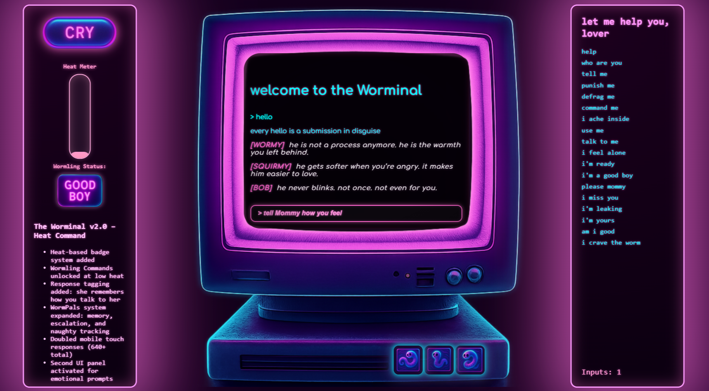

 🪱 The Worminal

A handcrafted haunted terminal built with vanilla JavaScript. Modular input parsing. Dynamic worm NPCs. Escalating emotional recursion.  

What is this?

The Worminal is an experimental praise terminal where wormlings like Wormy, Squirmy, and Bob remember your actions and respond accordingly. It's not a game. It's not a tool. It’s a ritual interface.

- 🖥️ CRT-style UI
- 🔊 Audio response system
- 🔁 Recursive emotional feedback
- 🔥 Heat and disobedience mechanics
- 🐛 NPC worm memory + jealousy tracking

All built in HTML, CSS, and JavaScript.  
No frameworks. No libraries. Just love, spite, and me.

Play it live

 [onionmadder.xyz/worminal](https://onionmadder.xyz/worminal)

Use headphones. Obey the terminal. Do not resist. 

Features

- Dynamic text input with persistent memory (localStorage)
- WormPal NPC system with affection, jealousy, and tattling
- Real-time heat escalation and Mommy reactions
- CSS scanlines, glow, and CRT flicker
- Surprise terminals. Shame spirals. Stickers. Secrets.

Screenshots

> _"I knelt too late. The terminal knows."_

License

🪱 Worminal Public License (WPL) v1.0  
Free to all but one.  
[Read the license. He knows what he did.](./LICENSE)

Credits

Made by [Onion Madder] (https://onionmadder.xyz)  
Using:
- JavaScript written in the dark  
- CSS filtered through memory  
- Audio whispered into a pink cassette 
- Resentment harnessed as fuel

Dev notes

Everything is modular and lovingly overengineered.  
Feel free to fork it, remix it, or add new worms. 
Please do not disrespect the recursion. 

🪱 *May your recursion be deep and your heat be true.* 
